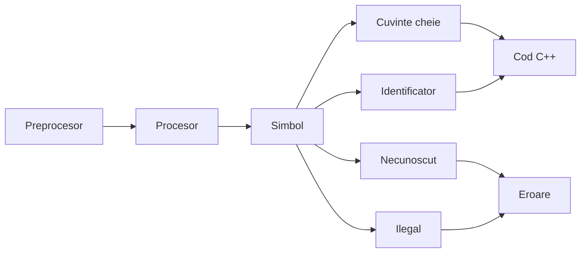
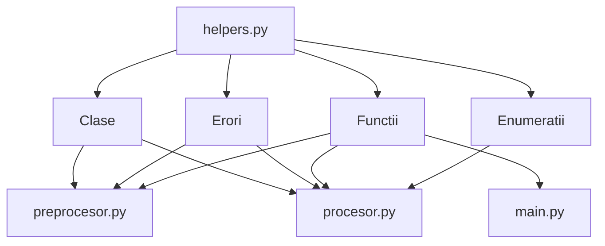
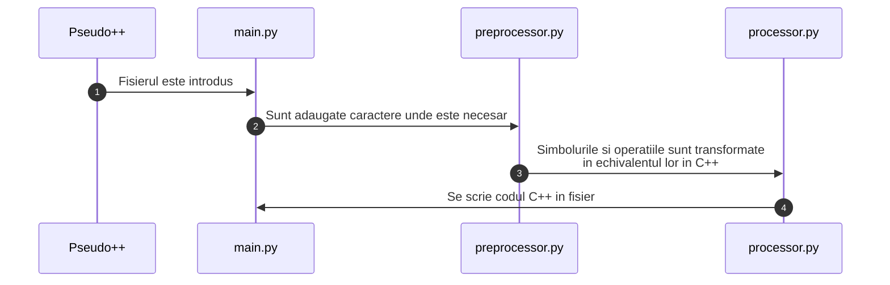

## Informatii generale
* Un traducător sursă-sursă, compilator sursă-sursă, transcompilator \
sau transpilator este un tip de traducător care ia ca intrare codul sursă al unui \
program scris într-un limbaj de programare și produce un cod sursă echivalent în același limbaj de programare sau într-un limbaj de programare diferit. Un traducător sursă-sursă convertește între limbaje de programare care operează aproximativ la același nivel de abstractizare, în timp ce un compilator tradițional traduce dintr-un limbaj de programare de nivel superior într-un limbaj de \
programare de nivel inferior. De exemplu, un traducător sursă-sursă poate \
efectua traducerea unui program din Python în JavaScript, în timp ce un \
compilator tradițional traduce dintr-un limbaj precum C în asamblare sau Java în bytecode.

* Pseudocodul reprezinta o descriere a pasilor unui algoritm folosind mai multe \
conventii ale limbajelor de programare (cum ar fi operatorul de atribuire, \
operatorul conditional, structura repetitiva, etc) folosind notatii informale si, de obicei, usor de inteles pentru actiuni si conditii. Chiar daca pseudocodul are caracteristici comune cu alte limbaje de programare, folosirea lui este intentionata pentru a fi citit de oameni, nu pentru a fi executat de calculatoare. Pseudocodul omite de obicie detalii care sunt esentiale pentru implementarea codului de catre un calculator. Programul este augumentat cu detalii de limbaj natural sau cu notatie matematica compacta. Pseudocodul este deseori folosit, deoarece este mai usor de inteles decat un limbaj de programare conventional, cat si pentru independenta sa fata de mediul delucru si de principiile cheie ale unui algoritm.

* Programul Pseudo++ este un compilator de la o sursa la alta. Acesta transforma pseudocod scris cu o sintaxa similara cu cea de Bacalaureat in cod C++ ce poate fi compilat si executat.

## Motivatia alegerii temei

* Am decis sa creez acest program pentru a-i ajuta mai ales pe elevii din clasa a IX-a de la profilul matematica-informatica sa invete programare. Cu ajutorul acestuia ei pot scrie mai usor algoritmi direct in pseudocodul pentru Bacalaureat. Pot vedea si codul echivalent in C++ pe care il pot executa pentru a verifica corectitudinea acestuia. Aceasta elimina necesitatea parcurgerii manuale pentru fiecare data de intrare introdusa in program. Aceasta idee a pornit dintr-o nevoie personala. In clasa a IX-a doream sa rulez programele pe care le scriam, dar, nestiind C++, nu aveam aceasta posibilitate. Totusi, avand cunostinte de Lua (un alt limbaj de programare), am rescris manual programele din pseudocod pentru a vedea cum functioneaza cu adevarat acestea. Astfel, doresc sa ajut elevii sa inteleaga mai usor programarea prin crearea acestui compilator dintr-o sursa in alta.

## Tehnologii folosite

* Python este un limbaj de programare de nivel inalt, de uz general. Filosofia sa de design pune accentul pe lizibilitateacodului prin utilizarea unei indentari semnificative. Acesta a fost creat de catre neerlandezul Guido van Rossum in 1991. Acesta este un limbaj scris dinamic cu un colector de gunoi. Suporta mai multe paradigme de programare, inclusiv programare structurata (in special procedurala), orientata pe obiecte si functionala. Este adesea descris ca un limbaj cu "baterii incluse" datoruta bubkuitecuu sake standard cuprinzatoare.
* Python se claseaza in mod constant ca fiind unul dintre cele mai populare limbaje de programare si a castigat o utilizare pe scara larga in comnitatea de invatare automata (machine learning).
* Tot codul a fost scris si testat in Visual Studio Code. Acesta este un editor de cod sursa dezvoltat de Microsoft pentru Windows, Linux si macOS. Printre caracteristicile sale se numara suportul pentru depanare, evidentierea sintaxei, completare inteligenta a codului, refactorizarae codului si Git incorporat. \
Utilizatorii pot schimba tema, comenzile rapide de la tastatura si preferintele si pot instala extensii care adauga functionalitati.
* Git este un sistem distribuit de control al versiunilor care urmareste modificarile i orice set de fisiere de calculator, utiliza de obicei pentru coordonarea muncii intre programatorii care dezvolta in colbatorare codul sursa in timpul dezvoltarii de software. Printreobiectivele sale se numara viteza, integritatea datelor si suportul pentru fluxuri de lucru distribuite, neliniare (mii de ramuri paralele care ruleaza pe diferite calculatoare). Git a fost scris initial de Linus Torvalds in 2005 pentru dezvoltarea nucleului Linux, alti dezvoltatori de nucleu contribuind la dezvoltarea sa initiala. Din 2005, Junio Hamano a fost mentorul principal. LA fel ca in cazul majoritatii celorlalte sisteme distribuite de control a versiunilor client-server, fiecare director git de pe fiecare calculator este un depozit cu drepturi depline, cu istoric complet si abilitati complete de urmarire a versiunilor, independent de accesul la retea sau de un server central. Git este un software gratuit si cu sursa deschisa, partajat sub licenta GPL-2.0-only.
* De la crearea sa, Git a devenit cel mai popular sistem distribuit de control a versiunilor, aproape 95% dintre dezvoltatori raportandu-l ca fiind principalul lor sistem de control al versiunilor incepand din 2022. Exista multe oferte populare de servicii de depozit Git, inclusiv GitHub, SourceForge, Bitbucket si GitLab.
* Codul sursa este tinut pe GitHub. GitHub este o platforma de dezvoltare ce permite dezvoltatorilor sa creeze, sa stocheze, sa gestioneze si sa partajeze \
codul lor. Foloseste software-ul Git, oferinde controlul distribuit al versiunilor Git, plus controlul accesului, urmarirea erorilor, solicitaro de caracteristici software, gestionarea sarcinilor, integrarea continua si wiki-uri pentru fiecare proiect.

\pagebreak

## Prezentarea codului sursa

* Utilizatorului i se dechide o fereastra de tip terminal in care programul va cere ca data de intrare fisierul ce trebuie transformat in C++ (cu extensia .pc), (optional) numele fisierului de iesire si calea (PATH) catre acesta. Acestea vor fi stocate in variabilele `input_file`, respectiv `output_file`.
* Fisierul de iesire (cu numele prestabilit "main.cpp") va fi pus in directorul curent daca nu este aleasa o cale.
* Variabila `raw_file` gaseste fisierul cu pseudocod pe dispozitivul utilizatorului. In lipsa acestuia va fi afisat un mesaj ce atentioneaza ca acesta nu exista.

```python
def main():
  input_file = input("Input file: ")
  output_file = input("Output file (leave blank for default): ")
  print("\n\n")

  if len(output_file) == 0:
    output_file = "./main.cpp"

  raw_file = Path(input_file)
  if not raw_file.is_file(): # checking if the input file exists
    print(f"File '{input_file}' does not exist!")
    print(EXIT_MESSAGE)
    return
```

\pagebreak

## Etapa de preprocesare

* Programul verifica codul scris in Pseudo++, linie cu linie si caracter cu caracter, si prelucreaza in mod specific cuvintele cheie, adaugand ';' dupa cele ce marcheaza terminarea unei instructiuni logice.
* Se instantiaza, de asemenea, variabila `counter` care va fi folosita prin intregul program pentru a facilita "comunicarea' dintre diferitele parti ale acestuia.

```python
counter = helpers.Counter()
  # processing the code and outputting it
  with open(input_file, "r") as f:
    for line in f: # go line by line

      line = line.strip()
      pos = 0 # the position which it's currently at
      tokens = line.split()
      for token in tokens: # adding ";" after/before each relevant keyword
        pos += len(token) + 1 # the +1 is to compensate for the space (separator)
        if token in ("altfel", "atunci", "executa", "repeta"): # add ';' after the keywords
          line = helpers.add_character_at(";", line, pos - 1)
          pos += 1
        elif token in ("stop", "citeste", "scrie"): # add ';' before the keywords
          line = helpers.add_character_at(";", line, pos - len(token) - 1)
          pos += 1

      line += "\n" # adding it back (removed above)
```

* Programul ia fiecare caracter din linia curenta, incadrand operatorii matematici intre spatii si semnaland o eroare daca se intampina vreo problema.
* Se contorizeaza, de asemenea, numarul liniilor de cod ale programului scris in Pseudo++.

```python
try:
  while i < len(line): # processing the current line
            # using a while-loop to properly have len(line) updated
    match line[i]:
      case "<":
        line, i = preprocessor.preprocess_larrow(line, i, counter)

      case "-":
        line, i = preprocessor.preprocess_minus(line, i, counter)

      case ">":
        line, i = preprocessor.preprocess_rarrow(line, i, counter)

      case "=":
        line, i = preprocessor.preprocess_equals(line, i, counter)

      case "/":
        line, i = preprocessor.preprocess_division(line, i, counter)

      case "+" | "*" | "%" | "[" | "]" | "(" | ")":
        line, i = preprocessor.preprocess_arithmetic_operator(line, i, counter)
    i += 1
except Exception as e:
  print(f"{type(e).__name__}: {e}")
  force_exit(g, output_file)
  return

counter.current_line += 1
```

\pagebreak

## Etapa de procesare

* Programul reia codul linie cu linie, cu schimbarile ulterioare adaugate \
de preprocesor, si il transforma in cod valid C++.
* Acesta efectueaza diferite operatii pe cuvintele cheie si pe instructiunile logice prezente, cum ar fi transformarea lor in echivalentul din C++, impartirea lor pentru o procesare mai eficienta, negarea lor (in structura repetitiva cu test final de tipul `repeta <instructiuni> pana cand <conditie>`) si altele.
* Pe parcursul programului sunt folositi termenii "simbol", "necunoscut", "ilegal" si "identificator".
  * Un "simbol" este un sir de caractere (de obicei un cuvant, o variabila, un numar, un caracter, etc) care este procesat de program. Acesta poate fi interpretat ca un cuvant cheie, ca o variabila, ca un operator sau ca o valoare de tip literal.
  * Un simbol "necunoscut" este o secventa care nu ar trebui sa apara intr-un anumit loc sau ceva ce programul nu recunoaste, cum ar fi cuvinte cheie scrise gresit (spre exemplu: `atnuci` sau `exeuta`) sau secvente ce nu au sens (spre exemplu: `YW1vZ3Vz`).
  * Un simbol "ilegal" reprezinta o secventa ce nu ar trebui sa apara intr-un anumit loc in cod, neavand sens sau avand un alt scop, cum ar fi folosirea unui cuvant cheie ca pe o variabila (`cat <- 1`).
  * Un identificator reprezinta o variabila cu un nume unic ce stocheaza o valoare de un anumit tip de date, de obicei un numar.




### Generalitati

* Toate functiile verifica respectarea sintaxei si semnaleaza erori la gasirea unor probleme. Acestea sunt: lipsa de paraneze, folosirea unui tip de date invalid, lipsa declararii variabilelor, prezenta ilegala sau lipsa operatorilor, a variabilelor sau a literalelor, prezenta unor cuvinte/simboluri necunoscute programului, etc.
* Nu sunt verificate erorile algebrice sau de logica matematica, obiectivul \
transpiler-ului fiind crearea unui fisier C++ echivalent celui scris in Pseudo++ din punct de vedere al structurilor logice si al instructiunilor. De asemenea, nu sunt in general permise operatiile algebrice in antetul structurilor repetitive sau logice.
* In programul principal este apelata functia `process_line` care apeleaza la randul ei celelalte functii pentru a procesa diferitele tipuri de structuri si intoarce linia procesata. Odata terminata procesarea (fara erori), linia procesata va fi scrisa in fisierul de tip C++.

```python
try: # try to process the current line
  processed_line = processor.process_line(line, counter)
except Exception as e: # if an exception is raised, display it and terminate the program
  print(f"{type(e).__name__}: {e}")
  force_exit(g, output_file)
  return

# Write the processed line to the file
g.write(processed_line)
```

### Operatii si sintaxa acestora

#### Citire

* Sintaxa: `citeste <variable> (<tip de date>)`
* Functia `process_user_input` proceseaza linii care efectueaza operatii de citire a datelor de intrare de un anumit tip de date.
* Se sterge cuvantul "citeste" din linia curenta si se verifica existenta tipului de date si al parantezelor. Se verifica existenta simbolurilor, apoi sunt cautate simboluri ilegale, cum ar fi cele de tip literal, cuvinte cheie, operatori.

```python
def process_user_input(line: str, counter: Counter):
    """
    Processes lines with the format `citeste <variables> (<data type>)` and
    returns the C++ equivalent
    """
    

    line = line.strip()
    line = line[8:] # remove "citeste" from the line
    line, _, data_type = line.partition("(")

    if len(data_type) == 0: # if the type (or paranthesis) is missing
        raise helpers.MissingKeywordError(f"Missing '(' or the data type on line {counter.current_line} (1201)")
    
    if data_type[-1] != ")":
        raise helpers.MissingKeywordError(f"Missing ')' on line {counter.current_line} (1202)")

    data_type = data_type[:-1].strip() # remove the ")"
    tokens = line.split(",")
    tokens = [x.strip(" ") for x in tokens] # removing unnecesary spaces

    if len(tokens) == 0: # if there are no variables being read
        raise helpers.MissingIdentifierError(f"Line {counter.current_line} (1203)")

    if data_type not in helpers.DATA_TYPES:
        raise helpers.UnknownTokenError(f"{data_type} on line {counter.current_line} (1204)")

    result = ""
    result += helpers.KEYWORDS[data_type] + " " # the data type of the variables

    for token in tokens: #declaring the variables and saving them for later usage
        
        result += f"{token},"
        counter.identifiers.append(helpers.Identifier(token, data_type))

        # check for literals/helpers.OPERATORS/reserved helpers.KEYWORDS
        if helpers.type_of(token, counter) in ("intreg", "real"):
            raise helpers.UnknownTokenError(f"{token} on line {counter.current_line} (1205)")
        
        if token in helpers.OPERATORS:
            raise helpers.UnexpectedOperatorError(f"{token} on line {counter.current_line} (1206)")
        
        if token in helpers.RESERVED_KEYWORDS:
            raise helpers.UnexpectedKeywordError(f"{token} on line {counter.current_line} (1207)")

```

* Se formateaza rezultatul in sintaxa de C++, adaugandu-se fiecare simbol in \
rezultatul final.

```python
    result = result[:-1] + ";\n" # finishing the line
    result += "cin>>"

    for token in tokens: # adding reading syntax for each token
        result += f"{token}>>"

    result = result[:-2] # removing extra ">>" from the end
    result += ";\n" # finishing the line

    return result
```

#### Afisare

* Sintaxa: `scrie <variabile/literal>`
* Functia `process_user_output` proceseaza linii care efectueaza operatii de afisare a datelor.
* Se sterge cuvantul "scrie" din linia curenta si se verifica existenta simbolurilor prin numararea secventelor separate prin virgula. Sunt cautate cuvinte cheie si simboluri necunoscute si sunt semnalate erori la gasirea lor folosind functia `check_for_errors`.

```python
def process_user_output(line: str, counter: Counter):
    """
    Processes lines with the format `scrie <variables | literals>` and returns the C++ equivalent
    """
    

    line = line.strip()
    line = line[6:] # remove "scrie" from the line
    tokens = line.split(",")

    if len(tokens) == 0:
        raise helpers.MissingIdentifierError(f"Line {counter.current_line} (1101)")

    tokens[-1] = tokens[-1].strip("\n")
    tokens = [x.strip(" ") for x in tokens] # removing unnecesary spaces

    result = "cout<<"

    result = helpers.check_for_errors(tokens, result, counter, "<<",
                              operators_allowed=True,
                              identifiers_allowed=True,
                              literals_allowed=True)

    result = result[:-2] # removing extra "<<" from the end
    result += ";\n" # finishing the line

    return result
```

#### Logica

* Sintaxa: `daca <conditii> atunci <instructiuni> stop`
* Functia `process_if_statement` proceseaza linii care efectueaza operatii \
conditionale logice.
* Se verifica existenta cuvantului cheie `atunci` si existenta simbolurilor prin numarare secventelor separate prin virgula. Sunt cautate cuvinte cheie si simboluri necunoscute si sunt semnalate erori la gasirea lor folosind functia `check_for_errors`. La final se concateneaza echivalentul din C++ al cuvantului cheie `atunci` gasit in enumeratia `KEYWORDS`.

```python
def process_if_statement(line: str, counter: Counter):
    """
    Processes lines with the format `daca <conditions> atunci` and returns the
    C++ equivalent
    """


    line = line.strip()
    result = ""
    tokens = line.split()
    if tokens[-1] not in ("atunci", "atunci;"):
        raise helpers.MissingKeywordError(f"\"atunci\" on line {counter.current_line} (1601)")
    
    result = helpers.KEYWORDS[tokens[0]] # "daca"
    tokens = tokens[1:-1] # removed "daca" & "atunci;"

    if len(tokens) == 0:
        raise helpers.MissingIdentifierError(f"Line {counter.current_line} (1602)")

    result = helpers.check_for_errors(tokens, result, counter, operators_allowed=True,
                                              identifiers_allowed=True,
                                              literals_allowed=True)

    return result + helpers.KEYWORDS["atunci"]
```

#### Structura repetitiva cu test initial

* Sintaxa: `cat timp <conditii> executa <instructiuni> stop`
* Functia `process_while_structure` proceseaza atat structurile de forma `cat timp <conditii> executa <instructiuni> stop`, cat si partea finala a \
structurilor de tipul `repeta <instructiuni> cat timp <conditie>`. Aceasta determina tipul structurii repetitive dupa prezenta cuvantului cheie `executa` si proceseaza diferit linia.
* In cazul in care este o structura `cat timp`, va fi incrementat numarul de terminatoare de structuri necesare. Se va verifica prezenta cuvintelor cheie si se va semnala o eroare in lipsa unuia dintre ele. Sunt cautate cuvinte cheie si simboluri necunoscute si sunt semnalate erori la gasirea lor folosind functia `check_for_errors`. In cazul in care exista o sublinie dupa cuvantul cheie `executa`, aceasta va fi procesata separata printr-un alt apel al functiei `process_line` si va fi concatenata rezultatului procesarii secventei initiale.

```python
def process_while_structure(line: str, counter: Counter):
    """
    Determines whether the "cat timp" is the start of a while-loop
    or the end of a repeat-while loop and processes the code accordingly.
    It splits the line into multiple lines after "executa" and processes them
    separately.

    The format processed is either `cat timp <conditions> executa` or `cat timp <conditions>` 
    """


    line = line.strip()
    result = ""
    exe_index = line.find("executa")
    if exe_index != -1: # while-loop
        counter.required_stops += 1
        while_loop, _, other = line.partition("executa")
        tokens = while_loop.split()
        result += "while ("
        
        if tokens[0] != "cat" or tokens[1] != "timp":
            raise helpers.MissingKeywordError(f"Line {counter.current_line} (1301)")
            
        tokens = tokens[2:] # remove "cat" & "timp"

        if len(tokens) == 0:
            raise helpers.MissingIdentifierError(f"Line {counter.current_line} (1302)")
        
        result = helpers.check_for_errors(tokens, result, counter, operators_allowed=True,
                                              identifiers_allowed=True,
                                              literals_allowed=True)
        
        result += helpers.KEYWORDS["executa"]

        processed_subline = ""
        if len(other):
            processed_subline = process_line(other, counter)

        return result + processed_subline
```

#### Structura repetitiva cu test final

* Sintaxa: `repeta <instructiuni> pana cand | cat timp <conditii>`
* Functia `process_repeat_until` proceseaza structurile repetitive cu test initial.
* Este folosita functia `process_while_structure` mentionata anterior pentru procesarea finalului structurii in cazul in care aceasta se termina in `cat timp`. Sunt cautate cuvinte cheie si simboluri necunoscute si sunt semnalate erori la gasirea lor folosind functia `check_for_errors`. In cazul in care nu apar cuvintele cheie `cat` sau `timp` este semnalata o eroare.

```python
def process_while_structure(line: str, counter: Counter):
  """
  Determines whether the "cat timp" is the start of a while-loop
  or the end of a repeat-while loop and processes the code accordingly.
  It splits the line into multiple lines after "executa" and processes them
  separately.

  The format processed is either `cat timp <conditions> executa` or `cat timp <conditions>` 
  """


  line = line.strip()
  result = ""
  exe_index = line.find("executa")
  if exe_index != -1: # while-loop
    # the code for the while-loop
  else: # end of repeat-while loop
        counter.loop_enders += 1
        result = "} while("
        tokens = line.split()
        
        if tokens[0] != "cat" or tokens[1] != "timp":
            raise helpers.MissingKeywordError(f"Line {counter.current_line} (1303)")
        
        tokens = tokens[2:] # remove "cat" & "timp"
        
        result = helpers.check_for_errors(tokens, result, counter, operators_allowed=True,
                                              identifiers_allowed=True,
                                              literals_allowed=True)

        result += ");"        
        return result
```

#### Structura repetitiva cu numar cunoscut de operatii

* Sintaxa: `pentru <variabila> <- <valoare | variabila>, <valoare | variabila>, <valoare | variabila>`
* Functia `process_for_loop` proceseaza structurile repetitive cu numar cunoscut de operatii, verificand daca iteratorul exista deja in vectorul cu variabile. Acesta proceseaza diferit iteratorul, limita si incrementul in functie de folosirea \
variabilelor sau a valorilor literale.
* Se verifica prezenta cuvantului cheie `executa` si se semnaleaza o eroare in cazul lipsei acestuia. Se verifica numarul de simboluri si se extrag iteratorul, limita si incrementul.

```python
def process_for_loop(line: str, counter: Counter):
    """
    Processes lines with the format 
    `pentru <variable> <- <variable | literal>, <variable | literal>, <variable | literal>`
    and returns the C++ equivalent
    """
    

    line = line.strip()

    if line[-7:] not in ("executa", "executa;"):
        raise helpers.MissingKeywordError(f"\"executa\" on line {counter.current_line} (1501)")

    line = line[7:-8] # remove "pentru" & "executa"
    result = "for ("
    tokens = line.split(",")

    if len(tokens) <= 2:
        raise helpers.MissingIdentifierError(f"Line {counter.current_line} (1502)")

    identifier, op, init_value = tokens[0].partition("<-") # the declaration of the iterator variable (ex: "i <- 1")
    identifier = identifier.strip()
    init_value = init_value.strip()
    bound = tokens[1].strip() # the value at which the for-loop ends
```

* Se verifica numeroase conditii, cum ar fi prezenta unor simboluri necunoscute, lipsa uneia dintre valorile necesare structurii sau prezenta ilegala a operatorilor, identificatorilor sau a valorilor de tip literal.

```python
  if len(tokens) > 3:
        raise helpers.UnknownTokenError(f"{tokens[3:]} on line {counter.current_line} (1503)")
    
    if len(op) == 0:
        raise helpers.MissingKeywordError(f"\"<-\" on line {counter.current_line} (1504)")
    
    if len(init_value) == 0:
        raise helpers.MissingLiteralError(f"Line {counter.current_line} (1505)")
        
    if len(identifier) == 0:
        raise helpers.MissingIdentifierError(f"Line {counter.current_line} (1506)")

    helpers.check_for_errors(init_value.split(), "", counter,
                     operators_allowed=True,
                     identifiers_allowed=True,
                     literals_allowed=True)
     
    helpers.check_for_errors(bound.split(), "", counter,
                     operators_allowed=True,
                     identifiers_allowed=True,
                     literals_allowed=True)

    if helpers.type_of(identifier, counter) in ("intreg", "real"):
        raise helpers.UnknownTokenError(f"{identifier} on line {counter.current_line} (1507)") 
```

* Se verifica daca valoarea initiala este un identificator deja declarat sau o valoare de tip literal.

```python
  if helpers.type_of(init_value, counter) == "identificator":
        iterator = helpers.Identifier(identifier, helpers.get_identifier_type(init_value, counter))
    else:
        iterator = helpers.Identifier(identifier, helpers.type_of(init_value, counter))
```

* Daca iteratorul nu este un identificator si daca tipul acestuia este necunoscut, va fi semnalata o eroare. Altfel, va fi creata linia corespunzatoare in C++ cu urmatoarea sintaxa: `<tip de date> <nume variabila> = <valoare initiala>`. Vor fi sterse, de asemenea, spatiile in plus care au fost adaugate de catre preprocesor sau de catre utilizator.

```python
if not helpers.is_identifier(iterator.name, counter):
        if iterator.type != "necunoscut":
            result += f"{helpers.KEYWORDS[iterator.type]} {iterator.name} = {init_value}; "
        else:
            raise helpers.UnknownTokenError(f"{iterator.name} on line {counter.current_line} (1508)")
    else:
        result += f"{iterator.name} = {init_value}; "

    increment = tokens[2].replace(" ", "") # removing all spaces added by the preprocessor (or already existing)
```

* Se adauga operatorii de comparatie si de incrementare din C++ in functie de tipul incrementului si de prezenta unui minus (`-`) inaintea sa cu sintaxa. Sirul generat are formatul `<variabila> <operatie aritmetica de comparatie> <variabila | valoare de tip literal>; <variabila> += <increment>{`
* Se adauga, de asemenea, iteratorul in lista de identificatori

```python
  counter.identifiers.append(iterator)
    # if the increment is an identifier, put the processed sign ("<=" or ">=")
    # depending on whether or not it has a '-' preceding it
    if helpers.is_identifier(increment, counter) or helpers.is_identifier(increment[1:], counter):
        if increment[0] == "-":
            result += f"{iterator.name} >= {bound}; {iterator.name} += {increment})" + "{"
        else:
            result += f"{iterator.name} <= {bound}; {iterator.name} += {increment})" + "{"
       
        return result

    # if the increment is a number literal, set the sign (">=" or "<=") accordingly
    if helpers.type_of(increment, counter) in ("real", "intreg"):
        if float(increment) > 0:
            result += f"{iterator.name} <= {bound}; {iterator.name} += {increment})" + "{"
        else:
            result += f"{iterator.name} >= {bound}; {iterator.name} += {increment})" + "{"
    elif helpers.type_of(increment, counter) == "caracter":
        result += f"{iterator.name} <= {bound}; {iterator.name} += {increment})" + "{"
    else: # if the increment is a string
        raise helpers.UnknownTokenError(f"{increment} on line {counter.current_line} (1509)")

    return result
```

#### Atribuirea valorilor variabilelor

* Sintaxa: `<variabila> <- <valoare> | <operatii>`
* Functia `process_assignment` verifica daca variabila este declarata prima oara si o adauga intr-un vector ce tine evidenta tuturor variabilelor. In caz contrar va \
verifica doar erorile de sintaxa. Sunt cautate cuvinte cheie si simboluri \
necunoscute si sunt semnalate erori la gasirea lor folosind functia `check_for_errors`.

```python
def process_assignment(line: str, counter: Counter):
    """
    Processes lines with the format `<variable> <- <variable | operation>`, adds them to the
    identifiers array if required and returns the C++ equivalent
    """


    line = line.strip()
    result = ""
    tokens = line.split()

    if not helpers.is_identifier(tokens[0], counter): # variable declaration
        result += "float "
        counter.identifiers.append(helpers.Identifier(tokens[0], "real"))

    result += tokens[0] + "="
    tokens = tokens[2:]

    result = helpers.check_for_errors(tokens, result, counter, operators_allowed=True,
                                              identifiers_allowed=True,
                                              literals_allowed=True)

    return result[:-1] + ";\n"
```

\pagebreak

## Erori si sintaxa

* In fisierul `helpers.py` se afla majoritatea functiilor si enumeratiilor folosite pentru verificarea sintaxei, cat si definitiile erorilor folosite in cod. Sunt definiti operatorii, cuvintele cheie si tipurile de date.




* Sunt definite functiile adjuvante pentru verificare, cum ar fi pentru:
  * tipul unei variabile, in functie de apartenenta sa la cuvinte cheie sau daca este o valoare de tip literal. Se verifica, in mod succesiv, lungimea \
simbolului, caracterul incipient si final, prezenta sa in lista de identificatori sau in enumeratii predefinite. In final, se verifica daca este un numar.
  
  ```python
  def type_of(value: str, counter: Counter):
    """
    Determines the type of `value` and returns it as a string
    """

    if len(value) == 0:
        return "necunoscut"

    if value[0] == "\"" and value[-1] == "\"":
        return "sir"

    for x in counter.identifiers:
        if x.name == value:
            return "identificator"

    if value in OPERATORS:
        return "operator"
    
    if value in RESERVED_KEYWORDS:
        return "keyword"

    value = value.replace(" ", "")

    try:
        value = int(value)
        return "intreg"
    except ValueError:
        try:
            value = float(value)
            return "real"
        except ValueError:
            return "necunoscut"
  ```
  
  * adaugarea unui caracter intr-un sir de caractere pe o anumita pozitie
  
  ```python
  def add_character_at(character: str, string: str, position: int) -> str:
    """
    Adds the given `character` at the given `position` and returns the new string
    """


    return string[:position] + character + string[position:]
  ```
  
  * cautarea erorilor, in functie de coonditiile specificate la apelul functiei. Fiecare simbol din linia data este verificat pentru apartenenta sa la cuvintele cheie ale sintaxei, cat si pentru tipul sau de data (literal, identificator sau necunoscut). Functia poate omite verificarea anumitor categorii in functie de parametri specificati. Dupa verificare, dupa fiecare simbol este adaugat un separator specificat in parametrul `sep` sau `" "` in caz contrar.
  * in cazul in care simbolul curent poate fi impartit in mai multe subsimboluri, acestea vor fi, la randul lor, verificate
  
  ```python
  def check_for_errors(tokens: list[str], result: str, counter: Counter, sep: str = " ", *, operators_allowed: bool = False, reserved_allowed: bool = False,
                      identifiers_allowed: bool = False, literals_allowed: bool = False) -> str:
    """Checks `tokens` for illegal tokens (specified in the params) and throws errors accordingly
    
    Returns the processed tokens added to `result`"""

    parentheses = 0 # ()
    brackets = 0 # []

    for token in tokens:
        # split the token further and verify its contents
        # (for example, arithmetic operations)
        subtokens = token.split()
        if len(subtokens) > 1:
            subresult = check_for_errors(subtokens, "", counter, " ",
                            operators_allowed=operators_allowed, reserved_allowed=reserved_allowed,
                            identifiers_allowed=identifiers_allowed, literals_allowed=literals_allowed)
            result += subresult + sep
            continue
        
        if type_of(token, counter) == "necunoscut":
            raise UnknownTokenError(f"{token} on line {counter.current_line} (2101)")

        if not reserved_allowed:
            if token in RESERVED_KEYWORDS:
                raise UnexpectedKeywordError(f"{token} on line {counter.current_line} (2102)")
        else:
            result += KEYWORDS[token] + sep
            continue

        if not operators_allowed:
            if token in OPERATORS:
                raise UnexpectedOperatorError(f"{token} on line {counter.current_line} (2103)")
        else:
            if token in OPERATORS:
                if token in ("(", ")"):
                    parentheses += 1
                if token in ("[", "]"):
                    brackets += 1
                result += f"{KEYWORDS[token] if KEYWORDS.get(token) is not None else token}" + sep
                continue
        
        if not literals_allowed:
            if type_of(token, counter) not in ("real", "intreg"):
                raise UnknownTokenError(f"{token} on line {counter.current_line} (2104)")
        else:
            if type_of(token, counter) != "identificator":
                result += token + sep
                continue
        
        if not identifiers_allowed:
            if is_identifier(token, counter):
                raise UnknownTokenError(f"{token} on line {counter.current_line} (2105)")
        else:
            if not is_identifier(token, counter):
                raise UnknownTokenError(f"{token} on line {counter.current_line} (2106)")
            
            result += token + sep
            continue

    if brackets % 2 != 0:
        raise MissingParenthesisError(f"on line {counter.current_line} (2107)")

    if parentheses % 2 != 0:
        raise MissingParenthesisError(f"on line {counter.current_line} (2108)")

    return result
  ```
  
  * cautarea operatorilor, cautand un anumit caracter (cu posibile exceptii \
  specificate in parametrul optional `omit`) in setul de operatori
  * acestia sunt ignorati in cazul in care apartin unui sir de caractere (valoare de tip literal)
  
  ```python
  def check_for_operators(line: str, pos: int, counter: Counter, omit: set[str] = set()):
    if line[pos] in OPERATORS - omit and not in_string_literal(line, pos):
        raise UnexpectedOperatorError(f"{line[pos]} on line {counter.current_line} (2201)")
  ```
  
  * gasirea tipului unui identificator, cautandu-l dupa numele acestuia in lista de identificatori a programului
  
  ```python
  def get_identifier_type(name: str, counter: Counter):
    for x in counter.identifiers:
        if x.name == name:
            return x.type

    raise MissingIdentifierError(f"Line {counter.current_line} (2301)")
  ```
  
  * verificarea unei secvente daca este sau nu un identificator, cautand-o in lista de identificatori a programului
  
  ```python
  def is_identifier(name: str, counter: Counter):
    for x in counter.identifiers:
        if x.name == name:
            return True

    return False
  ```

* Erorile utilizate in program sunt `UnknownTokenError`, `UnexpectedKeywordError`, `MissingKeywordError`, `UnexpectedOperatorError`, `MissingLiteralError` si `MissingIdentifierError`, `MissingParenthesisError`, reprezentand, in ordine: prezenta unui simbol necunoscut, folosirea ilegala a unui cuvant cheie, lipsa unui cuvant cheie, folosirea ilegala a unui operator, lipsa unei valori de tip literal, lipsa unui identificator si lipsa unei paranteze (rotunde sau patrate).
* Mesajele erorilor sunt acompaniate de un numar de 4 cifre care reprezinta locatia unde aceasta a fost sesizata: prima cifra (1 sau 2) reprezinta fisierul `processor.py`, respectiv `helpers.py`, a doua cifra reprezinta numarul de ordine al functiei din fisier (care poate trimite erori), iar ultimele doua cifre identifica numarul de ordine al erorii respective din erorile sesizate in functie. Spre exemplu, codul de eroare `2201` arata ca eroarea a fost declansata in fisierul `helpers.py` in a doua functie a sa (`check_for_operators()`), fiind prima eroare din aceasta.
* Sunt definiti si operatorii si cuvintele cheie din sintaxa Pseudo++.

```python
OPERATORS = {"[", "]", "(", ")", "+", "-", "/", "*", "%", "si", "sau", "=", "<-", ">", "<", ">=", "<=", "!=", "!"}
STRUCTURE_KEYWORDS = {"cat", "timp", "executa", "repeta", "pana", "cand", "daca", "atunci", "altfel",
            "citeste", "scrie", "pentru", "iesi", "stop"}
DATA_TYPES = {"natural", "intreg", "real", "sir", "caracter"}
RESERVED_KEYWORDS = set.union(STRUCTURE_KEYWORDS, DATA_TYPES)
```

* Clasa `Identifier` este folosita pentru stocarea datelor despre identificatori, avand drept atribute numele si tipul acestora.

```python
class Identifier:
  def __init__(self, name: str, type: str) -> None:
    self.name = name
    self.type = type
```

\pagebreak

## Inainte de rezultatul final

* Se verifica daca sunt prezente in program destule cuvinte cheie de inchidere a structurilor repetitive sau a structurilor logice (`stop`, respectiv `pana cand`/`cat timp`).
* In cazul in care nu sunt prezente destule (sau daca sunt prea multe) va fi semnalata o eroare si programul se va termina fara a afisa rezultatul.

```python
if abs(counter.required_loop_enders - counter.loop_enders) > 0:
  print(f"StopsError: {counter.required_loop_enders} necessary structure terminators - {counter.loop_enders} present")
  force_exit(g, output_file)
  return
elif abs(counter.required_stops - counter.stops) > 0:
  print(f"StopsError: {counter.required_stops} necessary stops - {counter.stops} present")
  force_exit(g, output_file)
  return

g.close()
```

## Rezultatul final

* Programul va scrie in fisierul ales la inceput (sau in fisierul "main.cpp" in \
directorul curent in caz contrar) rezultatul compilarii din Pseudo++ in C++.

\pagebreak

## Structura programului

* Programul este impartit in 3 fisiere: `main.py`, `processor.py`, `preprocessor.py` si `helpers.py` pentru structurarea mai eficienta si logica a codului.




* Acestea comunica transmit informatii de stare intre ele prin intermediul parametrului de tip `Counter`, clasa acestuia fiind definita in `helpers.py`. Parametrul contine starea curenta programului: numarul de terminatoare de structuri (conditionale sau repetitive) necesare si prezente, linia curenta si lista cu identificatorii definiti in program.

```python
class Counter:
  def __init__(self) -> None:
    self.required_stops = 0
    self.required_loop_enders = 0
    self.stops = 0
    self.loop_enders = 0
    self.current_line = 0
    self.identifiers: list[Identifier] = []
```

* `main.py`: Consta in afisarea interfetei catre utilizator si in apelarea anumitor functii din celelalte fisiere, cat si afisarea rezultatului final.

* `preprocessor.py`: Contine toate functiile de preprocesare ale programului folosite in prima etapa a acestuia.

* `processor.py`: Contine toate functiile de procesare a linilor, inclusiv verificarea majoritatii sintaxei si tinerea evidentei variabilelor (numite in cod "identificatori")

* `helpers.py`: Contine definitia multor clase si functii adjuvante folosite in celelalte fisiere, cum ar fi toate clasele de erori, `Counter`, `Identifier` si lista de cuvinte cheie

# Exemplu de executie

* Executia programului si introducerea datelor de intrare
\begin{figure}
\includegraphics[width=10cm]{./images/execution.png}
\end{figure}

* Fisierul de intrare (creat de utilizator) in Pseudo++
\begin{figure}
\includegraphics[width=5cm]{./images/input-file.png}
\end{figure}

* Fisierul de iesire (creat de program) in C++
\begin{figure}
\includegraphics[width=5cm]{./images/output-file.png}
\end{figure}
