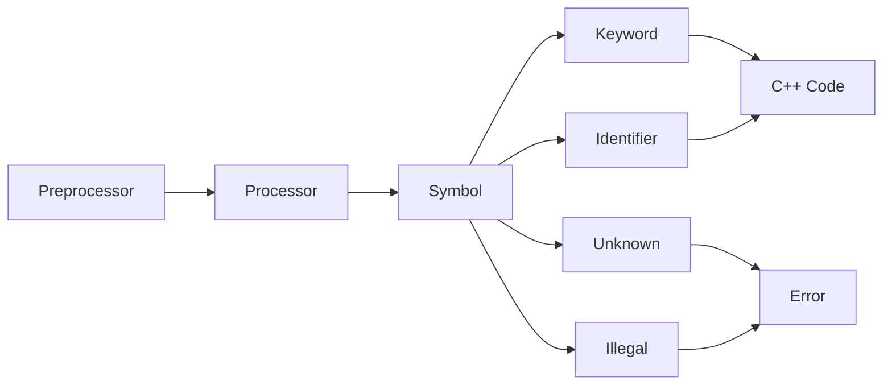
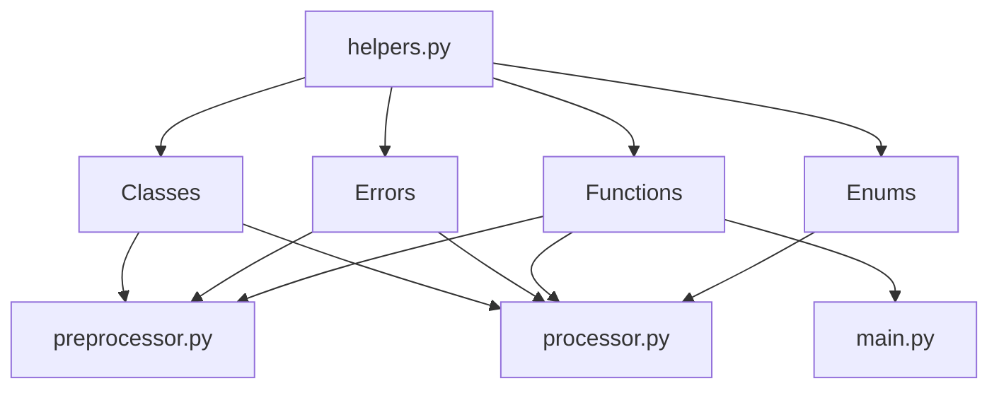
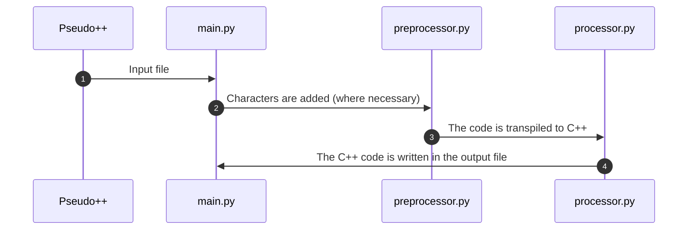

# Pseudo++

Pseudo++ is a pseudocode (based on the romanian Bacalaureat syntax) to C++ transpiler. It was designed to help highschool students "compile" the code they write on paper before they learn how to write proper C++ code in order to better learn and understand fundamental concepts in programming.

# Structure

The program is split into multiple stages: preprocessing, processing and code output.

## Input
Upon start, the user is prompted in the terminal to select the file (with the extensions `.pc`) they want to transpile and the file (PATH) to write the output to.

## Preprocessing
The program analyses the code, line by line and word by word, and adds ';' after the end of logic instructions and operators. This way, the processor manipulates the code more easily.

## Processing
The program analyses the preprocessed code, line by line, and transpiles it to C++. It tranforms keywords to their C++ counterparts (`daca` to `if`, for example) or performs certain operations where necessary, such as negating the running condition in a `repeta ... pana cand` loop to fit the `do ... while` C++ syntax and logic.
The processor splits lines into "symbols" (words, numbers, characters, keywords etc). "Unknown" symbols (which have no reason to appear in the program, such as unknown variables or misspelt keywords) and "illegal" symbols (using keywords as variables, for example) throw errors. Regular keywords and expected symbols are transformed into valid C++ code.

## Other
This is a _transpiler_. It only checks for syntactic errors. It does not check whether the operations performed are valid or not.

## Output
The program will output in the file chosen in the beginning by the user (or "./main.cpp" by default) the transpiled C++ code.

# Syntax

* input: `citeste <identifier> (<data type>)`
* output: `scrie <identifiers | literal>`
* if statement: `daca <conditions> atunci <instructions> stop`
* while-do: `cat timp <conditions> executa <instructions> stop`
* repeat until/while: `repeta <instructions> pana cand | cat timp <conditions>`
* for-loop: `pentru <identifier> <- <value | identifier>, <value | identifier>, <value | identifier>`
* variables: `<identifier> <- <value> | <operations>`

# File structure
* `helpers.py` contains most functions and enums used for syntax checking and errors. The operators, keywords and data types are also defined there. These are used by the other files.

# Visual diagram of the program

